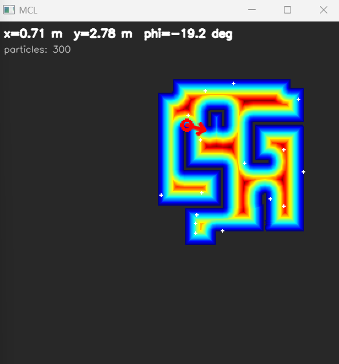
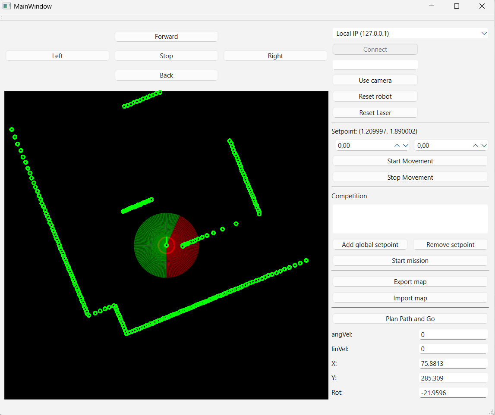

# Technická dokumentácia k zadaniam RMR

Kompletný stack pre mobilný robot Kobuki, ktorý pokrýva všetky zadania počnúc odometriou a regulátorom cez reaktívnu navigáciu, mapovanie, plánovanie až po Monte Carlo lokalizáciu.

---

## 1. Architektúra

Vlákno robota (callback `processThisRobot`) je jediné miesto vzájomnej interakcie všetkých komponentov. Callback z LiDARu (`processThisLidar`) ukladá nové dáta a nastaví flag `new_lidar_data`. Sychronizácia je zabezpečená cez mutexy `lidar_data_mutex`, `main_process_mutex`, `navMutex`, `mclMutex`.

Stavy robota a "misie" sú definované v `custom_types.h`:

- `RobotState`: `MAPPING` (počiatočný stav, robot mapuje prostredie) → `LOCALIZING` (mapa je vytvorená, robot sa lokalizuje) → `LOCALIZED` (algoritmus MCL konvergoval, pozícia odom je prepísaná najlepšou pózou)
- `MissionState`: `IDLE` → `LOCALIZING` (počas globálnej lokalizácie sa náhodne posiela na `goToRandom`) → `EXECUTING` (postupne prechádza zadané body z `missionSetpoints`)

> Pod pojmom "misia" chápeme súhrn úloh, ktoré robot vykoná pri stlačení tlačidla "Start mission"

---

## 2. Pomocné dátové typy a štruktúry

### `custom_types.h`
Je v nej definovaná sada dátových typov používaných viacerými triedami:

- `Pose { double x, double y, double phi }` – pozícia [x, y] a orientácia robota v radiánoch
- `Point { double x, double y }` – 2D bod (m)
- `XYQPoint { Point p, int scanQuality, uint32_t timestamp }` – LiDAR bod prepočítaný do globálnych súradníc
- `Particle { Pose pose, double weight }` – častica pre Monte Carlo lokalizáciu
- Enumy `RobotState`, `MissionState` - definujú stavy robota a misie (viď. vyššie)

### `utility.cpp / .h`
V `utility` namespace sú dve pomocné funkcie:

- `wrap(double angle)` – používa sa na normalizáciu uhla do intervalu `<-π, π)`
- `pow(double x)` – druhá mocnina `x*x` vstupného argumentu

---

## 3. `Trieda Odometry` – odometria z kolies a gyroskopu

Trieda spracováva surové dáta z enkóderov a gyroskopu, poskytuje:

1. **Aktuálnu polohu/natočenie** `(x, y, phi)` v metroch / radiánoch
2. **Lineárnu a uhlovú rýchlosť** (derivácia podľa `synctimestamp`)
3. **Stack uložených póz** s časovými značkami (`_poseStack`, max. dĺžka 15) pre kompenzáciu pohybu LiDARu

### Významné metódy

- `init(TKobukiData)` – nastaví počiatočné stavy encoderov a gyroskopu, inicializuje rotáciu `_rot` z gyroskopu
- `update(TKobukiData)` – jadro výpočtu:
  - Zo surových dát enkóderov sa určuje poloha [x, y]
  - Pretečenie enkóderov je ošetrené statickým pretypovaním
  - Rozdiel v natočení `deltaRot` sa získava z gyra, prepočet `°` → rad násobenie hodnotou `π/18000`
  - Pozície x a y sa počíta cez jednoduchý model `x += d·cos(φ); y += d·sin(φ)` (lineárny pohyb). V komentároch sme ponechali aj exaktnejšiu varianta s pohybom po kružnicových oblúkochm ktorá sa nepoužíva pre nízke rozlíšenie gyra
  - Aktualizuje rýchlosti `_v`, `_omega` pre výpis do GUI a do `_poseStack` zapisuje `{timestamp, pose}`
- `compensateLidarScan(laserData, parsedPoints)` – kompenzácia pohybu počas jedného LiDAR scanu (motion-distortion correction). Pre každý lúč:
  1. Nájde najbližšiu uloženú pózu v `_poseStack`, ktorá nastala **pred** zaznamenaním lúča
  2. Pomocou `interpolatePosition` lineárne interpoluje pózu medzi dvomi susednými časovými značkami
  3. Prepočíta lúč na globálny bod `(laser_x, laser_y)` a následne ho premietne späť do súradnicovej sústavy aktuálnej pózy.
  4. Plní `parsedPoints` (XY body)
  
  Mŕtve zóny `0.6 – 0.75 m` a `LIDAR_MIN_DIST = 0.1 m` odfiltrujú hodnoty, vznikajú nedokonolasťou LiDARU pri neštandardných odrazoch lúča.
- `interpolatePosition(p1, p2, t1, t2, t)` – lineárna interpolácia XY a uhla
- `extrapolatePosition(p0, v, w, t)` – extrapolácia na základe `v`, `ω` (pre `ω=0` sa jedná o lineárny pohyb). Slúži pre prípady, keď LiDARový scan príde skôr ako sa spracuje odometria
- `getCurrentPoseEstimate(t)` – vráti predpokladanú pózu použitím `extrapolatePosition`
- `laserToPoint(laser)` / statická `laserToPoint(observer, laser)` – konverzia lidarového lúča `LaserData` (vzdialenosť v mm + uhol) na bod `Point`
- `setPose(pose, data)` – slúži na prepísanie vnútorného stavu po konvergencii algoritmu MCL, vyčistí `_poseStack` a znovu inicializuje polohu v triede Odometry, aby ďalší `update` pracoval s aktuálnymi dátami

### Konštanty
- `_wheelBase = 0.230 m` (rázvor kolies)
- `_tickToMeter ≈ 8.53 × 10⁻⁵`
- `POSE_STACK_MAX_SIZE = 15` – pri 40 Hz odometrie a 8 Hz LiDARu potrebuje minimálne 5
- `LIDAR_MIN_DIST = 0.1` - minimálna validná vzdialenosť snímania

---

## 4. Trieda `LidarOdometry`
> Odometria zo skenov, ktorá mala slúžiť na lepší odhad polohy a natočenia, bohužiaľ sa nestihla dokončiť

---

## 5. Trieda `PathTracker` – regulátor polohy s profilovaním rýchlosti

Regulátor s nastaviteľnými parametrami *(ρ, α, β)*. Pracuje s frontom cieľov `setpoints` typu `std::deque<Point>`, ktorý reprezentuje buď jeden setpoint, alebo celú trajektóriu z plánovača.

### Parametre

| Konštanta | Hodnota | Význam |
|---|---|---|
| `k_rho_` | 3 | zosilnenie pre lineárnu rýchlosť |
| `k_alpha_` | 16 | zosilnenie pre azimut |
| `k_beta_` | 0 | zosilnenie pre konečnú orientáciu  |
| `V_MAX` | 0.4 m/s | strop lineárnej rýchlosti |
| `W_MAX` | π/5 rad/s | strop uhlovej rýchlosti |
| `ACCELERATION_MAX` | 0.5 m/s² | maximálne zrýchlenie |
| `BRAKING_MAX` | 1.0 m/s² | maximálne spomalenie |
| `ANGULAR_ACCELERATION_MAX` | 3·π rad/s² | maximálne uhlové zrýchlenie |
| `POSITION_EPSILON` | 0.015 m |tolerancia polohovej odchýlky |
| `POSITION_EPSILON_DYNAMIC` | 0.20 m | tiež tolerancia odchýlky, ale pri dosiahnutí bodov z frontu, nie pri konečnom setpointe |
| `REGULATION_ZONE_DIST` | 0.10 m | hranica medzi profilovaním rýchlosti a nastavením regulátorom |
| `SAMPLING_PERIOD` | 0.025 s | fixná vzorkovacia perióda (rieši vynechané rámce) |

### Významné metódy

- `update(odom)` – štandardná aktualizácia bez VFH. Vypočíta zosilnenia pre regulátor a zavolá `regulate(ρ, α, β)`. Ak `ρ < POSITION_EPSILON`, regulátor sa zastaví
- `updateVFH(odom, safe_heading)` – varianta používaná pri reaktívnej navigácii. `α` nie je smer k cieľu, ale rozdiel medzi cieľovým natočením z VFH+ a aktuálnou orientáciou robota

**Prepočet ρ**:
  - ak `|α| > π/4`, `ρ` sa nastaví na hodnotu medzi `POSITION_EPSILON` a  `REGULATION_ZONE_DIST` (robot sa najprv otočí a až potom sa pohne smerom dopredu),
  - inak `ρ ← ρ · (1 − |α|/(π/3.5))` – plynulé spomalenie
  - Cyklus `while (setpoints.size() > 1 && ρ < POSITION_EPSILON_DYNAMIC) pop_front()` zabezpečuje sledovanie nasledujúceho setpointu v trajektórii.
- `regulate(ρ, α, β)` – jadro výpočtu:
  1. Vypočíta sa `v = k_rho·ρ`, `w = k_alpha·α + k_beta·β`
  2. Vypočíta sa **krivosť** `k = w/v`, ktorú sa regulátor snaží zachovať.
  3. Ak `ρ > REGULATION_ZONE_DIST`, prepočíta sa **profilovaná rýchlosť** `v_prof = √(2·s·a_max)` a vyberie sa väčšia z `v_prof` a `v`
  4. Z požadovaného `(v, w)` sa cez `SAMPLING_PERIOD` dopočítajú požadované zrýchlenia, obmedzujú sa na limity `± ACCELERATION_MAX` a opätovne sa získa nový príkaz pre rýchlosť.
  5. Príkazy sa limitujú do `±V_MAX`, `±W_MAX`

- `getProfiledVelocity(dist, zone)` – z brzdnej dráhy spätne počíta maximálnu bezpečnú `v`, aby robot stihol zabrzdiť na hranici regulačnej zóny. Vracia `min(v, V_MAX)`
- `start()` / `stop()` / `brake()` – stop zruší celú trajektóriu (`setpoints.clear()`), brake iba dosadí `(0,0,0)` do regulátora (zachová ciele)
- `setSetpoint(x,y)` – vloží bod na začiatok frontu
- `setGoalSetpoint(x,y)` – vloží cieľ na koniec frontu
- `setTrajectory(traj)` – nastaví trajektóriu zo setPointov.
- `transformSetpoints(old, new)` – slúži na transfromáciu setpointov po konvergencii MCL algoritmu, zabraňuje tomu, že naplánovaná trajektória bude na iných miestach mapy.

---

## 6. Trieda `Navigation` – VFH+ algoritmus

Implementácia rozšíreného algoritmu reaktívnej navigácie **Vector Field Histogram (VFH+)**. Pracuje s aktuálnym scanom a niekoľkými prvkami (binárny histogram, posledný smer). Výstupom je  **bezpečné natočenie** alebo `std::nullopt`, ak neexistuje žiadny voľný smer.

### Konštanty
- `NUM_SECTORS = 120`, `SIGMA = 3°` (120 sektorov, rozlíšenie 1 sektor = 3°)
- `DS = 0.1 m` – bezpečná vzdialenosť od prekážky, ktorú má robot dodržať
- `RADIUS = 0.17 m` – polomer robota
- `WIN_SIZE = 0.5 m` – polomer aktívnej snímanej oblasti
- `_t_low = 10`, `_t_high = 20` – prahy pre hysterézu (binárny histogram)
- `S_MAX = 20` – maximálna šírka úzkeho údolia
- `_a = 18, _b = 7` – koeficienty použité pri výpočte magnitúdy prekážky `m = a − b·d`
- `_mu1, _mu2, _mu3 = (4.0, 2.5, 2.0)` – váhy v cost funkcii (cieľ, aktuálne smerovanie, predošlý smer)c
= `valley_edge = S_MAX/20` - vzdialenosť od posledného blokovaného sektoru - okraj širokého údolia

### Algoritmus (`update`)

1. **Primárny polárny histogram** (`calcPHist`):
  - Pre každý platný lúč v okne `RADIUS < d < WIN_SIZE` sa vypočíta zväčšovací uhol `γ = asin((RADIUS+DS)/d)`.
  - Magnitúda každej prekážky `m = max(0, a − b·d)` sa pripočíta do primárneho histogramu pre všetky sektory, do ktorých daná prekážka zasahuje.
2. **Binárny histogram s hysterézou**:
  - Predošlý binárny histogram sa rotuje o `shift = ΔrPhi/SIGMA`, aby boli zachované pozície sektorov voči natočeniu robota.
  - Hodnota `0` (voľno) ak `pHist[k] < t_low`, `1` (prekážka) ak `> t_high`, inak sa do nového histogramu prenesie predošlá hodnota.
3. **Maskovaný histogram** (`mHist`) – maskovanie na základe dynamických obmedzení robota:
  - Z aktuálnych `v` a `ω ± W_MAX` sa určí maximálne ľavý a pravý polomer otáčania `r_l, r_r`. Stredy kružníc sú na ramenách kolmých k pohybu (`cl_y = r_l`, `cr_y = -r_r`).
  - Pre každý lúč sa kontroluje, či leží v dosahu týchto kružníc; ak áno, určí "neprejazdné" úseky `phi_l` (pre prekážky vľavo) a `phi_r` (vpravo).
  - Sektory mimo prejazdnej zóny dostávajú `mHist[k] = 1`. Pri pomalom pohybe alebo státí (`v < 1e-3`) sa maskovanie vynechá.
4. **Kandidátske údolia** (`findCandidateSectors`):
  - Ak je celý histogram nulový, kandidátom sa stáva sektor cieľa (prejazd je voľný).
  - Inak sa skenuje od prvého prechodu `1 → 0` a kontrolujú sa údolia. Krátke údolie (`length ≤ S_MAX`) má kandidátsky smer v jeho strede; v širokom sú dva kandidátske smery `_valley_edge` od oboch krajov a prípadne sektor cieľa, ak ním údolie prechádza.
5. **Cost-funkcia** (`selectBestSector`):
  - `cost = μ1·d(k, k_target) + μ2·d(k, k_robot_heading) + μ3·d(k, k_prev)`, kde `d` je cirkulárna vzdialenosť.
  - Vybraný cieľ s najnižšou cost-function sa konvertuje pomocou `sectorToSafeHeading` späť do globálneho azimutu v radiánoch, ktorý sa potom posiela do PathTrackera.
6. `isDirWithinCurrentSector(dir, robot_rot)` – pomocný test, či zadaný globálny smer leží v aktuálne zvolenom sektore (do `SIGMA/2`).

### Výstupy
- `update(...)` → `std::optional<double>` - bezpečné natočenie alebo bezpečnostné zastavenie v prípade, že všetky sektory sú blokované
- `getLastMHist()` → maskovaný histogram pre vykreslenie v UI (kruhový diagram okolo robota)

---

## 7. `Mapper` – mapovanie priestoru

### Reprezentácia mapy
- `_map_cv` je `cv::Mat` typu `CV_16UC1` o rozmere `(2·MAP_MAX_SIZE/MAP_CELL_SIZE) + 1` (pri 7 m a 0.05 m bunke ide o 281×281 mriežku).
- Stred mapy `_mid_point` zodpovedá svetovému `(0, 0)`. Konverzia `pointToMapIndex` / `mapIndexToPoint` zaokrúhľuje na bunky.
- V jednej bunke žijú **rôzne triedy hodnôt** rozdelené prahmi:
  - `0 … HITS_TO_REGISTER-1` – počet zásahov LiDARu (akumulácia registrovaných bodov z LiDAR-u),
  - `HITS_TO_REGISTER = 20` – stabilná prekážka (`ID_OBSTACLE`),
  - `ID_OBSTACLE_INFLATED = 21` – zväčšená prekážka,
  - `ID_START_POS = 22`, `ID_GOAL_POS = 23`, `ID_PLANNING_RANGE_START = 24` – štartové, cieľové a plánovacie vrstvy (od 24 vyššie nesú "vzdialenosť od štartu" pre flood-fill).

### Mapovanie
- `init()` – vytvorí prázdnu mriežku.
- `init(cv::Mat map)` – načítanie uloženej mapy (`map.bmp`), všetko nenulové sa nastaví na `HITS_TO_REGISTER`.
- `update(odom, laserData)` – jednoduchá verzia bez kompenzácie pohybu (volá `odom.laserToPoint(beam)`).
- `update(parsedPoints)` – preferovaná verzia: berie už globálne `XYQPoint` body z `Odometry::compensateLidarScan` a inkrementuje bunkové počítadlá cez `registerPoint`. Bunka prekročí `HITS_TO_REGISTER` len výnimočne – inkrement sa zastropuje.
- `getMapFiltered()` – vráti binárnu masku stabilných prekážok (`_map_cv == HITS_TO_REGISTER`). Tá ide do MCL a do exportu.

### Plánovanie
1. `clearPlan()` – pred plánovaním zruší starý záplavový algoritmus aj predošlú trajektóriu.
2. `inflateObstacles(0.2 m)` – pre každú obsadenú bunku označí jej `2·radius+1` × ... okolie ako `ID_OBSTACLE_INFLATED`. Po zaplavení sa pôvodné prekážky obnovia.
3. Označia sa `ID_START_POS` (aktuálna pozícia) a `ID_GOAL_POS` (cieľ).
4. `floodFill(start)` postupne v plánovacích vrstvách prepisuje voľné bunky hodnotou `level` (začína `ID_PLANNING_RANGE_START`). Iteračná funkcia `floodFillIteration` skončí, akonáhle dorazí na `ID_GOAL_POS`.
5. `getKeypoints(goal)` rekonštruuje cestu **spätne od cieľa** k štartu (vždy vyberie suseda s najnižším `level`). Body sa pridávajú do výstupu len v miestach, kde dôjde k zmene smeru – výsledkom je riedka sada zlomových bodov.
6. Cesta sa otočí (od štartu k cieľu), prevedie na metre cez `mapIndexToPoint` a doplní sa pôvodný cieľ.
7. `getPathPlan()` vráti hotový plán pre `PathTracker::setTrajectory`.

`cv::imshow("Flood Fill Values", ...)` v `plan()` slúži na vizuálny debugging a validáciu.

---

## 8. `mclocalizer` – Monte Carlo lokalizácia

Štandardná **Monte Carlo lokalizácia** s adaptívnym počtom častíc. Vstupom je binárna mapa prekážok z `Mapper::getMapFiltered()`, výstupom najpravdepodobnejšia póza robota a jej kovariancia (resp. test konvergencie).

### Inicializácia (`init`)
1. Mapa sa uloží, vypočíta sa `_cellSize` a `_midPoint`.
2. `createDistanceField()`:
   - `cv::distanceTransform` vyrobí pole vzdialenosti k najbližšej prekážke (v metroch).
   - `cv::connectedComponents` rozdelí voľné bunky na zložky, **zložky dotýkajúce sa okraja** sa vyhlásia za "vonkajšie". Zostane iba vnútro miestnosti, z ktorého sa následne sampluje (`_validFreeCells`, `_insideMask`). Ak miestnosť nie je uzavretá, záloha je ohraničujúci box všetkých prekážok.
3. `_particles` (default 1000) sa rovnomerne rozhodia po platných voľných bunkách s náhodnou orientáciou a rovnakou váhou `1/N`.

### Motion (pohybový) model (`updateMotion`)
- Pohyb sa dekomponuje na 3 časti (rot1, trans, rot2):
  - `rot1 = atan2(dy, dx)` (počiatočné natočenie k cieľu),
  - `trans = √(dx²+dy²)` (translácia/lineárny pohyb),
  - `rot2 = wrap(dphi − rot1)` (finálne dotočenie).
- Pre každú zložku sa odhadne `σ` ako kombinácia parametrov šumu `a1…a4` (šum rotácie záviší od rotácie aj translácie a naopak).
- Z týchto `σ` hodnôt sa urobí normálne rozdelenie, z ktorého sa vyberie náhodný šum a vypočítajú sa nové (x, y, φ) každej častice.
- Ak nová póza náhodou leží v stene (`!isFree`), častica sa preresampluje do náhodnej voľnej pozície – inak by skončila zaseknutá.

### Aktualizácia váh (`updateWeights`)
Pre každú časticu sa scan podvzorkuje (`LASER_STRIDE = 5`):
- Lúč sa premietne do globálneho rámca **z pohľadu danej častice**.
- Vypočíta sa vzdialenosť k najbližšej prekážke (`distToNearestObstacle`).
- Naakumulovaná chyba je vzdialenosť od steny; finálna váha `1 / (errorSum + ε)`.
- Po prejdení všetkých častíc sa váhy normalizujú na sumu 1.

### Resampling (`resample`)
- `_injectionRatio = 5 %` častíc sa nahradí novými, náhodne rozhodenými. Tým sa MCL bráni uviaznutiu v lokálnom maxime.
- Zvyšok častíc sa vyberá váhovaným ruletovým výberom

### Konvergencia (`isLocalized`)
- Zoradí častice podľa váhy, zoberie horných 90 % (zvyšných 1O% zahodí).
- Vypočíta vážený priemer `(mx, my, mphi)` (orientácia cez `sin/cos`) a vážený rozptyl.
- Robot sa pokladá za lokalizovaného, ak smerodajné odchýlky padnú pod `_locStdXY = 0.05 m` a `_locStdPhi = 0.05 rad`.

### Vizualizácia (`getVisualization`)
- Distance field sa farebne prekreslí cez `COLORMAP_JET`, oblasti mimo miestnosti sa zafarbia tmavo.
- Častice sa vykreslia ako bodky.
- Najlepšia častica je vykreslená červenou šípkou a textový panel vo vrchnej časti obrazovky vypisuje najlepšiu pózu `x, y, phi`.

---

## 9. `robot.cpp` – orchestrácia a celý "stack"

Centrálny `QObject`, ktorý vlastní inštancie `Odometry`, `LidarOdometry`, `Mapper`, `Navigation`, `PathTracker`, `mclocalizer` a `libRobot`-komunikátor. Beží v hlavnom Qt vlákne, ale callbacky `processThisRobot` a `processThisLidar` ho volajú z internných vlákien knižnice `librobot`, preto všetka kritická logika je chránená mutexmi.

### Štart (`initAndStartRobot`)
1. Registruje LiDAR callback (`processThisLidar`) a Kobuki callback (`processThisRobot`) cez `libRobot`-API, voliteľne aj kameru a skeleton tracker.
2. `mapper.init()` – pripraví prázdnu mapu.
3. `robotCom.robotStart()` – rozbehne vnútorné vlákna SDK.

### Callback `processThisLidar`
Iba uloží surový scan do `copyOfLaserData` a nastaví `new_lidar_data = true`. Všetka výpočtová logika je presunutá do `processThisRobot`.

### Callback `processThisRobot` – hlavný "tick"
1. **Mutex sanity check** – ak je mutex zamknutý, znamená to, že predošlá slučka ešte beží (varovanie do `stderr`).
2. **Inicializácia + odometria**:
  - Pri prvom volaní `odom.init(robotdata)`.
  - `odom.update(robotdata)` aktualizuje pozíciu, rýchlosť a pose-stack.
3. **Spracovanie LiDARu** (pod `lidar_data_mutex`):
  - Ak prišli nové dáta, zavolá `odom.compensateLidarScan(...)`, ktorá zároveň naplní pole `XYQPoint`.
  - Ak je `_state == LOCALIZED`, mapa sa aktualizuje (`mapper.update(xyPointCloud)`) a zobrazí (`plotMap()`).
  - Emituje `publishLidar`, aby UI prekreslil bodový oblak.
4. **MCL** (pod `mclMutex`):
  - Vypočíta lokálny pohyb medzi `_lastMclOdom` a aktuálnou pózou (rozdiel v *teleskopickom* rámci predošlej pózy, nie v globálnom).
  - Ak je pohyb väčší ako `5 mm` alebo `~0.3°`, beží `updateMotion → updateWeights → resample`.
  - Po konvergencii (`mcl.isLocalized()` & `_state == LOCALIZING`): stav sa zmení na `LOCALIZED`, ciele v `PathTracker` sa transformujú (`transformSetpoints`) a aj samotná `Odometry` sa "teleportuje" na najlepšiu pózu (`odom.setPose`).
  - Otvorí `cv::imshow("MCL", ...)` pre vizualizáciu.
5. **Regulácia pohybu** (ak `PathTracker` beží):
  - Z aktuálnej pózy a cieľa sa vypočíta cieľový azimut.
  - VFH+ (`nav.update`) vráti bezpečný smer alebo `nullopt`.
  - `nullopt` → `path_tracker.brake()` (núdzové brzdenie bez vyprázdnenia trajektórie).
  - Inak → `path_tracker.updateVFH(odom, safe_heading)`. Vypočítaný príkaz sa pošle do robota cez `setSpeed` (lineárna rýchlosť v mm/s, uhlová v rad/s).
  - Emituje histogram `publishHistogram` na vykreslenie.
6. **Stavový automat misie**:
  - `LOCALIZING`: čaká, kým MCL skonverguje, a pravidelne (každých `40·15` tickov) posiela robot na náhodný cieľ (`goToRandom`), aby sa generoval pohyb potrebný pre konvergenciu MCL.
  - `EXECUTING`: keď tracker dobehne, popne ďalší cieľ z `missionSetpoints` (`goToNextGoal`). Tu sa vyvolá `mapper.plan(...)`, výsledná trajektória sa odovzdá trackeru. Ak plánovanie zlyhá, použije sa reaktívna navigácia.
  - Po vyprázdnení zoznamu setpointov sa prejde do `IDLE`.
7. **UI synchronizácia** – každý piaty tick emituje `publishPosition` so škálovanými hodnotami (cm, °), aby sa neblikalo.

### Pomocné metódy
- `plotMap()` – cez OpenCV vykreslí prefiltrovanú binárku mapy.
- `exportMap()` / `importMap()` – zápis `map.bmp` a načítanie + inicializácia MCL + prechod do stavu `LOCALIZING`.
- `goToRandom()` – náhodný cieľ z intervalu [0, 7] m × [0, 7] m, klasický single-setpoint.
- `goToNextGoal()` – zoberie prvý cieľ z `missionSetpoints`, zavolá plánovač a spustí pohyb po naplánovanej trajektórii.
- `setMissionState(state)` – riadi prechody misijného stavu (idle/lokalizovať/vykonávať).
- `startMission()` – `importMap() + setMissionState(LOCALIZING)`.
- `stopMission()` – `setMissionState(IDLE)`.

### Qt signály
- `publishPosition(x, y, phi, omega, v)` – UI metriky.
- `publishLidar(scan)` – body LiDARu na vizualizáciu.
- `publishHistogram(mHist)` – kruhový histogram VFH+.
- `stateChanged(int)` – zmena `RobotState`.
- (voliteľne) `publishCamera`, `publishSkeleton`.

---

## 10. `MainWindow` – Qt UI

Hlavné okno aplikácie. Drží jednu inštanciu `robot _robot`, slot funkcie pre signály z robota, vlastnú vizualizáciu LiDARu / setpointov / VFH histogramu a obsluhu gombíkov.

### Súradnicové sústavy
- `globalToRobotFrame(globalPoint)` prevedie svetový bod do **robot-centrickej rotovanej** sústavy. `rot = -odom.getRot() + π/2`, lebo UI vykresľuje X smerom hore.
- `widgetXYtoWorldXY(x, y)` je inverzná operácia – z kliku do widgetu vypočíta svetovú pozíciu (pomocou aktuálnej pózy odometrie).
- `setSetpoint(x, y)` zobrazí v UI label "Setpoint: (x, y)" a uloží do `_setpointX/Y`.

### Vykresľovanie (`paintEvent`)
- Vykreslí čierne pozadie, rámik widgetu, červený stredový marker (robot).
- Ak je k dispozícii VFH histogram (`_lastMHist`), vykreslí pomocou `paintVFH` kruhový diagram okolo robota – zelené sektory sú voľné, červené blokované.
- LiDAR body sa konvertujú cez `laserDataToPoints` (otáčanie scanu o 360 − uhol kvôli zhode so súradnicovým systémom widgetu) a kreslia sa zelenými bodkami.
- Setpointy z `PathTracker` sa vykresľujú modrou; cesta sa zobrazuje v lokálnom systéme.

### Slot-y na signály
- `setUiValues(x, y, fi, omega, v)` – aktualizácia textových polí.
- `paintThisLidar(...)` – uloží scan, nastaví `updateLaserPicture = true` a vyvolá `update()` (prekreslenie).
- `onHistogramUpdated(mHist)` – uloží histogram pre nasledujúce `paintEvent`.
- `onRobotStateChanged(s)` – placeholder (pôvodne mal blokovať tlačidlo plánovania, kým nie je `LOCALIZED`).
- `paintThisCamera`, `paintThisSkeleton` – aktualizácia kamerového / skeleton bufferu (voliteľné).

### Event filter
`eventFilter` na widgete s vizualizáciou zachytáva ľavé kliknutie myši a cez `widgetXYtoWorldXY` ho prevedie na svetový bod, ktorý sa uloží ako aktuálny setpoint. Tým možno kliknutím v okne zadať cieľ.

### Tlačidlá a slot-y

| Tlačidlo | UI text | Slot | Akcia |
|---|---|---|---|
| `pushButton_9` | **Connect** | `on_pushButton_9_clicked` | Vypne sám seba, prepojí signály robota so slot-mi MainWindow, zavolá `_robot.initAndStartRobot(ipaddress)` |
| `pushButton_2` | **Forward** | `on_pushButton_2_clicked` | `_robot.setSpeed(500, 0)` – priamy príkaz 0.5 m/s vpred. |
| `pushButton_3` | **Back** | `on_pushButton_3_clicked` | `setSpeed(-250, 0)` – 0.25 m/s vzad. |
| `pushButton_6` | **Left** | `on_pushButton_6_clicked` | `setSpeed(0, π/2)` – rotácia doľava. |
| `pushButton_5` | **Right** | `on_pushButton_5_clicked` | `setSpeed(0, −π/2)` – rotácia doprava. |
| `pushButton_4` | **Stop** | `on_pushButton_4_clicked` | `setSpeed(0, 0)`. |
| `pushButton` | **Use camera / Use laser** | `on_pushButton_clicked` | Prepína `useCamera1`, label sa mení medzi režimami "use camera" a "use laser". |
| `pushButton_10` | **Start Movement** | `on_pushButton_10_clicked` | Pridá aktuálny `_setpointX/Y` ako cieľ (`setGoalSetpoint`) a spustí `PathTracker`. |
| `pushButton_11` | **Stop Movement** | `on_pushButton_11_clicked` | Zastaví `PathTracker`, ukončí misiu (`stopMission`), pošle `setSpeed(0,0)`. |
| `pushButton_12` | **Export map** | `on_pushButton_12_clicked` | `_robot.exportMap()` → `map.bmp`. |
| `pushButton_13` | **Import map** | `on_pushButton_13_clicked` | `_robot.importMap()` (načíta `map.bmp`, inicializuje MCL, prejde do `LOCALIZING`). |
| `pushButton_14` | **Plan Path and Go** | `on_pushButton_14_clicked` | Skontroluje, či je robot `LOCALIZED`. Ak áno, vezme aktuálnu MCL pózu ako štart, `_setpointX/Y` ako cieľ, zavolá `mapper.plan(...)`, výslednú trajektóriu odovzdá `PathTracker` a spustí ho. |
| `addGlobalSetpointpushButton` | **Add global setpoint** | `on_addGlobalSetpointpushButton_clicked` | Z hodnôt v `setpointXSpinBox` a `setpointYSpinBox` pridá nový globálny cieľ do `missionSetpoints`, prekreslí list. |
| `removeSetpointpushButton` | **Remove setpoint** | `on_removeSetpointpushButton_clicked` | Vyhodí posledný cieľ zo zoznamu. |
| `startMissionpushButton` | **Start mission** | `on_startMissionpushButton_clicked` | `_robot.startMission()` – načíta mapu, prejde do `LOCALIZING` (MCL).` Po konvergencii sa misia automaticky prepne do `EXECUTING`. |
| `setpointXSpinBox` / `setpointYSpinBox` | – | `on_setpointXSpinBox_valueChanged`, `on_setpointYSpinBox_valueChanged` | Pri zmene hodnoty volajú `setSetpoint(...)` – synchronizujú label aj interný setpoint. |
| `IPComboBox` | – | `on_IPComboBox_currentIndexChanged` | Prepína IP medzi `127.0.0.1` a `192.168.1.11` (simulátor vs. reálny robot). |
| `setpointListView` | – | – | Iba zobrazenie zoznamu globálnych setpointov; obsluhuje ho `generateGlobalSetpointListViewContent()`. |
| `pushButton_7` / `pushButton_8` | **Reset Laser / Reset robot** | (slot nie je prepojený) | Tlačidlá z UI bez priradeného slot-u – príprava na rozšírenia. |

Finálny vizuál vyzerá nasledovne

---

## 11. Kompletný tok aplikácie (end-to-end)

1. **Spustenie**: `main.cpp` vytvorí `MainWindow`. Konštruktor pripraví UI, predvyplní IP (`on_IPComboBox_currentIndexChanged(0)`), inštaluje event-filter na widget vizualizácie.
2. **Connect (`pushButton_9`)**: užívateľ stlačí tlačidlo. Naviažu sa signály z `robot` na slot-y MainWindow, zavolá sa `_robot.initAndStartRobot(ip)` (zaregistrujú sa callbacky pre Kobuki/LiDAR/kameru, štart vlákien).
3. **Mapovacia fáza** (`RobotState::MAPPING`):
  - Robot je ovládaný buď manuálne (gombíky Forward/Back/Left/Right, joystick), alebo automatickými cieľmi (Start Movement po kliknutí v okne / SpinBoxoch).
  - Pri každom ticku `processThisRobot` aktualizuje odometriu, kompenzuje LiDAR scan, ale **mapu zatiaľ neaktualizuje** (lebo nie je `LOCALIZED`). Užívateľ však môže prejsť okolo mapovaného priestoru manuálne – tu je trochu nekonzistencia s konvenciou stavov, mapper update sa v praxi rozbieha až po prvom načítaní mapy.
  - **Export map** (`pushButton_12`) uloží binárnu mapu do `map.bmp`.
4. **Lokalizačná fáza** (`RobotState::LOCALIZING`):
  - **Import map** (`pushButton_13`) alebo **Start mission** (`startMissionpushButton`, ktoré tiež volá `importMap` interne) načíta mapu, inicializuje MCL s 1000 časticami rovnomerne v interiéri.
  - Pri **misii** robot dostane náhodné ciele (`goToRandom`), pohybuje sa, MCL postupne aktualizuje váhy a resampluje.
  - Akonáhle `isLocalized()` vráti `true`, MCL odovzdá najlepšiu pózu do `Odometry::setPose` (teleport) a všetky čakajúce ciele v PathTrackeri sa pretransformujú podľa rozdielu `old → new pose`.
5. **Vykonávacia fáza** (`RobotState::LOCALIZED` + `MissionState::EXECUTING`):
  - `goToNextGoal` zoberie prvý globálny cieľ z `missionSetpoints` (pridané cez `Add global setpoint`).
  - `Mapper::plan(curr, goal)` urobí vlnoplochu, extrahuje rohové body trajektórie a dá ich `PathTracker`-u.
  - V každom tick-u sa volá `nav.update(...)` (VFH+), ktoré vyberá bezpečný smer na obchádzanie prekážok aj v zaplánovaných úsekoch (reaktivita na dynamické prekážky). `PathTracker::updateVFH` zladí krivosť, profilovanie a klampovanie.
  - Príkazy idú do robota cez `setSpeed`. Mapa sa naďalej aktualizuje – z `XYQPoint` cloudu sa zaznamenávajú nové prekážky.
  - Po dosiahnutí všetkých cieľov: `MissionState::IDLE`.
6. **Plánovanie ad-hoc** (`pushButton_14`, "Plan Path and Go"):
  - Funguje len v `LOCALIZED` stave. Pre štart sa berie `mcl.getBestPose()`, pre cieľ `_setpointX/Y` (kliknutie alebo SpinBox).
  - Plánovanie + setTrajectory + start – analógia bodu 5 mimo misie.
7. **Stop Movement (`pushButton_11`)** kedykoľvek preruší tracker aj misiu a vynuluje rýchlosti.
